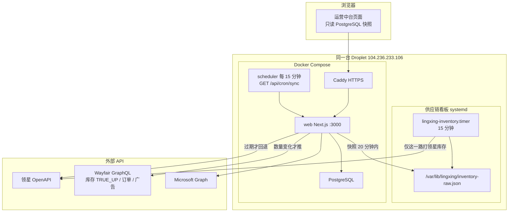
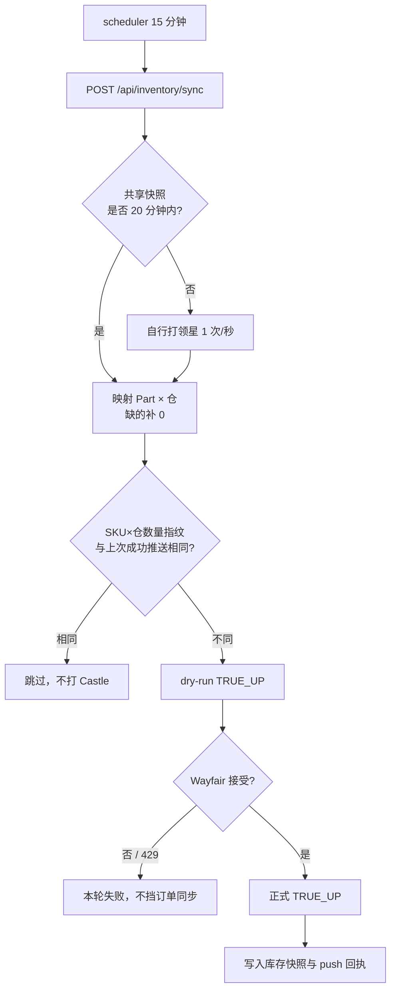
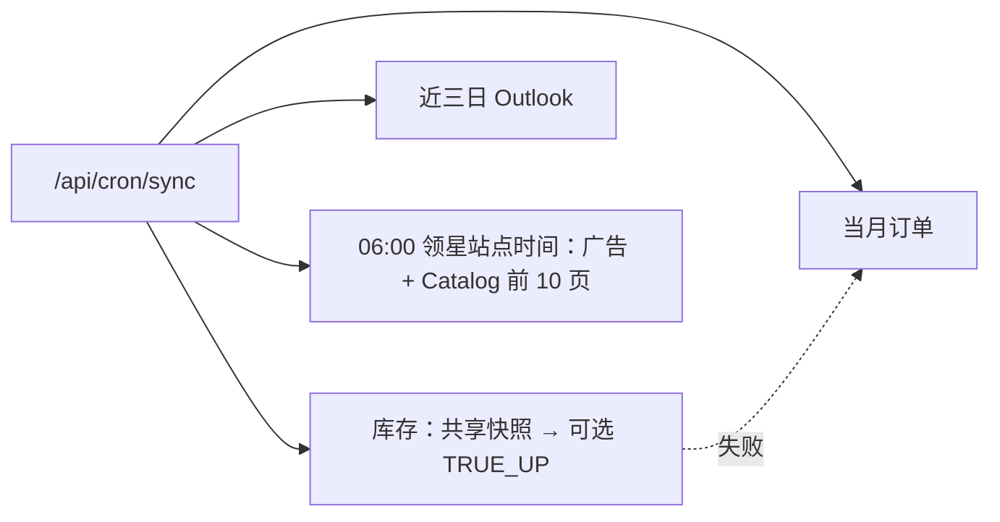

# 系统架构与同步原理

> 生产只在 `https://aiwayfair.sunnysdady.com`。领星库存由供应链看板拉取后共享，本中台 20 分钟内不重复打 OpenAPI。
> 部署手册：[DIGITALOCEAN_DEPLOYMENT.md](./DIGITALOCEAN_DEPLOYMENT.md)。看板仓库：https://github.com/sunnysdady/supply-chain-workbench

## 系统架构

| 层 | 生产方案 |
|---|---|
| 页面 / API | Droplet 上 Next.js，Caddy 终止 TLS |
| 库存源 | 看板 systemd 写入的共享 JSON，只读挂载进 web 容器 |
| 定时 | Scheduler → `/api/cron/sync`（Bearer `CRON_SECRET`） |
| 库 | PostgreSQL；报告文件在 Spaces |
| 写入 Wayfair | 默认关闭；库存需 dry-run 通过 + 零库存确认逻辑 |

## 库存 TRUE_UP 原理

- 完整基线必须是 **TRUE_UP**（全量 Part × 仓库），缺失组合补零，避免平台残留旧库存。
- 指纹用 SKU×仓数量哈希，避免合计件数此消彼长时漏推。
- 领星限流或 Castle 429：本轮跳过，下一窗口再试。

## 15 分钟 cron 分层

库存失败不中断订单 / 邮件。页面不直接调领星或 Castle 写接口；写操作只走受保护 API。

## 和供应链看板的边界

| | 供应链看板 | 本中台 |
|---|---|---|
| 拉领星库存 | **唯一主路径**，15 分钟 | 只读共享快照，过期才回退 |
| 拉领星销售 | 每小时当天 / 02·14 UTC 整月 | 不拉店级日报 |
| 写 Wayfair | 无 | dry-run 后 TRUE_UP |
| 发布 | `index.html` → GitHub → Vercel | `production` 分支 → Droplet 镜像 |
