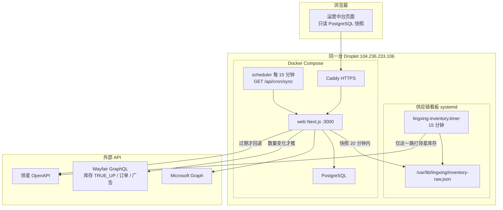
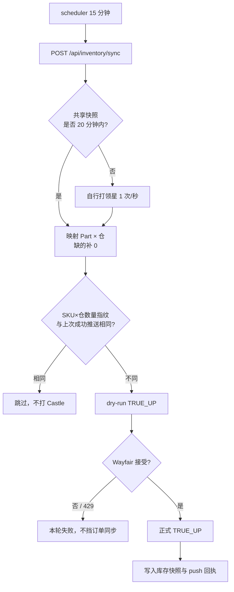
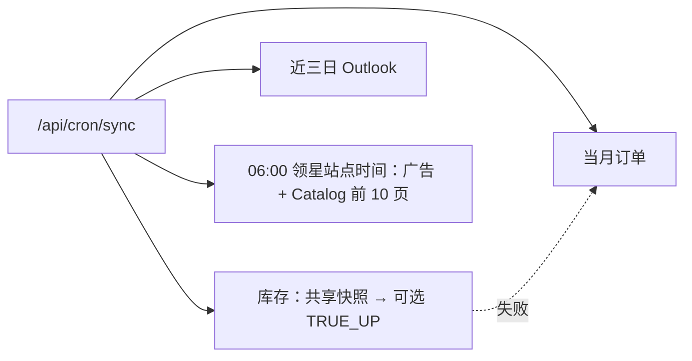

# 系统架构与同步原理

> 生产只在 `https://aiwayfair.sunnysdady.com`。领星库存由供应链看板拉取后共享，本中台 20 分钟内不重复打 OpenAPI。
> 部署手册：[DIGITALOCEAN_DEPLOYMENT.md](./DIGITALOCEAN_DEPLOYMENT.md)。看板仓库：https://github.com/sunnysdady/supply-chain-workbench

## 系统架构

```mermaid
flowchart TB
  subgraph Client["浏览器"]
    UI["运营中台页面\n只读 PostgreSQL 快照"]
  end

  subgraph Droplet["同一台 Droplet 104.236.233.106"]
    subgraph WB["供应链看板 systemd"]
      TInv["lingxing-inventory.timer\n15 分钟"]
      RAW["/var/lib/lingxing/inventory-raw.json"]
    end
    subgraph Compose["Docker Compose"]
      WEB["web Next.js :3000"]
      SCH["scheduler 每 15 分钟\nGET /api/cron/sync"]
      CADDY["Caddy HTTPS"]
      PG["PostgreSQL"]
    end
  end

  subgraph External["外部 API"]
    LX["领星 OpenAPI"]
    CASTLE["Wayfair GraphQL\n库存 TRUE_UP / 订单 / 广告"]
    MS["Microsoft Graph"]
  end

  UI --> CADDY --> WEB --> PG
  TInv -->|"仅这一路打领星库存"| LX
  TInv --> RAW
  SCH --> WEB
  WEB -->|"快照 20 分钟内"| RAW
  WEB -->|"过期才回退"| LX
  WEB -->|"数量变化才推"| CASTLE
  WEB --> MS
```

| 层 | 生产方案 |
|---|---|
| 页面 / API | Droplet 上 Next.js，Caddy 终止 TLS |
| 库存源 | 看板 systemd 写入的共享 JSON，只读挂载进 web 容器 |
| 定时 | Scheduler → `/api/cron/sync`（Bearer `CRON_SECRET`） |
| 库 | PostgreSQL；报告文件在 Spaces |
| 写入 Wayfair | 默认关闭；库存需 dry-run 通过 + 零库存确认逻辑 |

## 库存 TRUE_UP 原理

```mermaid
flowchart TB
  CRON["scheduler 15 分钟"] --> SYNC["POST /api/inventory/sync"]
  SYNC --> AGE{"共享快照\n是否 20 分钟内?"}
  AGE -->|是| MAP["映射 Part × 仓\n缺的补 0"]
  AGE -->|否| API["自行打领星 1 次/秒"]
  API --> MAP
  MAP --> FP{"SKU×仓数量指纹\n与上次成功推送相同?"}
  FP -->|相同| SKIP["跳过，不打 Castle"]
  FP -->|不同| DRY["dry-run TRUE_UP"]
  DRY --> OK{"Wayfair 接受?"}
  OK -->|否 / 429| STOP["本轮失败，不挡订单同步"]
  OK -->|是| LIVE["正式 TRUE_UP"]
  LIVE --> DB["写入库存快照与 push 回执"]
```

- 完整基线必须是 **TRUE_UP**（全量 Part × 仓库），缺失组合补零，避免平台残留旧库存。
- 指纹用 SKU×仓数量哈希，避免合计件数此消彼长时漏推。
- 领星限流或 Castle 429：本轮跳过，下一窗口再试。
- **推送节奏**：每 15 分钟拉取并更新快照，向 Wayfair 正式推送最多每小时一次（`nextPushAfter` 窗口）。推送成功、被安全闸门拦截（403）、需人工确认零库存，都要等满 1 小时再试；限流和临时失败不占用窗口，下一轮直接重试。
- **安全闸门**：自动推送仍受 `ALLOW_WAYFAIR_LIVE_PUSH`、`WAYFAIR_EXPECTED_SUPPLIER_IDS` 控制，未放行时记为 `blocked` 并显示在库存页，不会绕过。
- **零库存确认**：零库存占比 ≥50% 时，定时任务只在占比不高于上次成功推送（含页面手动推送）10 个百分点以内时代为确认；没有成功推送过的基线或占比突增，则停在 `needs-confirm`，需在页面人工确认推送一次。
- 最近一次拉取/推送结果写在 `sync_state` 的 `server:inventory-auto:last-run`，库存页直接展示。

## 15 分钟 cron 分层

```mermaid
flowchart LR
  A["/api/cron/sync"] --> I["库存：共享快照 → 可选 TRUE_UP"]
  A --> O["当月订单"]
  A --> E["近三日 Outlook"]
  A --> X["06:00 领星站点时间：广告 + Catalog 前 10 页"]
  I -.->|失败| O
```

库存失败不中断订单 / 邮件。页面不直接调领星或 Castle 写接口；写操作只走受保护 API。

## 和供应链看板的边界

| | 供应链看板 | 本中台 |
|---|---|---|
| 拉领星库存 | **唯一主路径**，15 分钟 | 只读共享快照，过期才回退 |
| 拉领星销售 | 每小时当天 / 02·14 UTC 整月 | 不拉店级日报 |
| 写 Wayfair | 每小时最多 1 次 | dry-run 后 TRUE_UP |
| 发布 | `index.html` → GitHub → Vercel | `production` 分支 → Droplet 镜像 |
